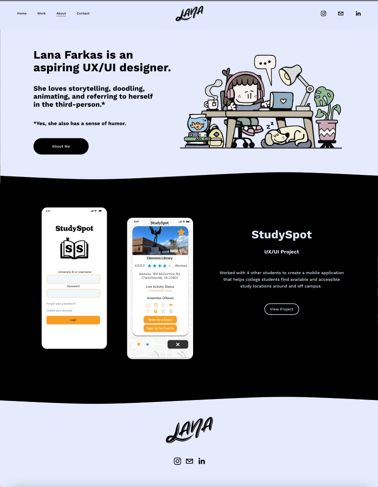
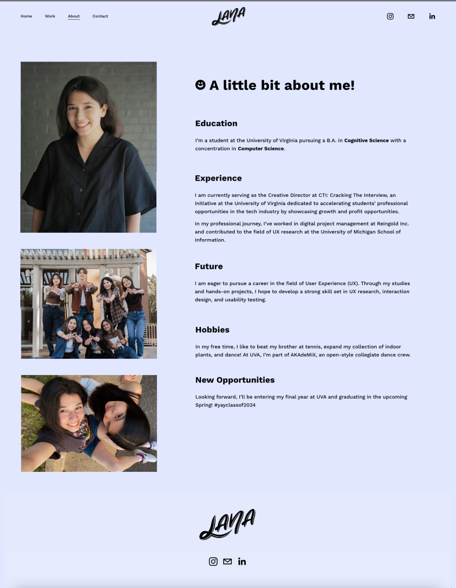
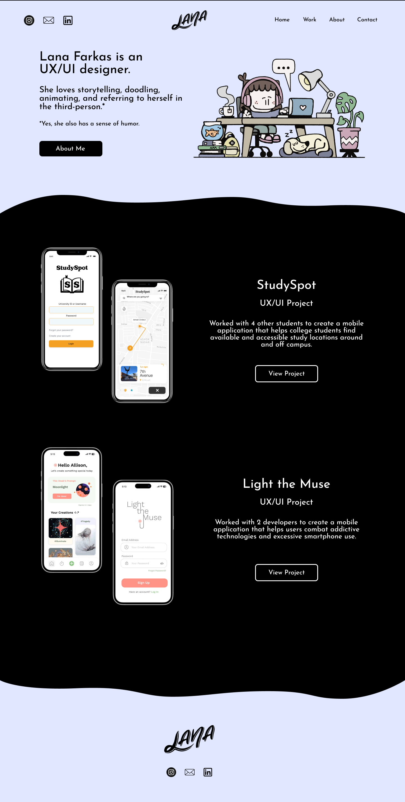
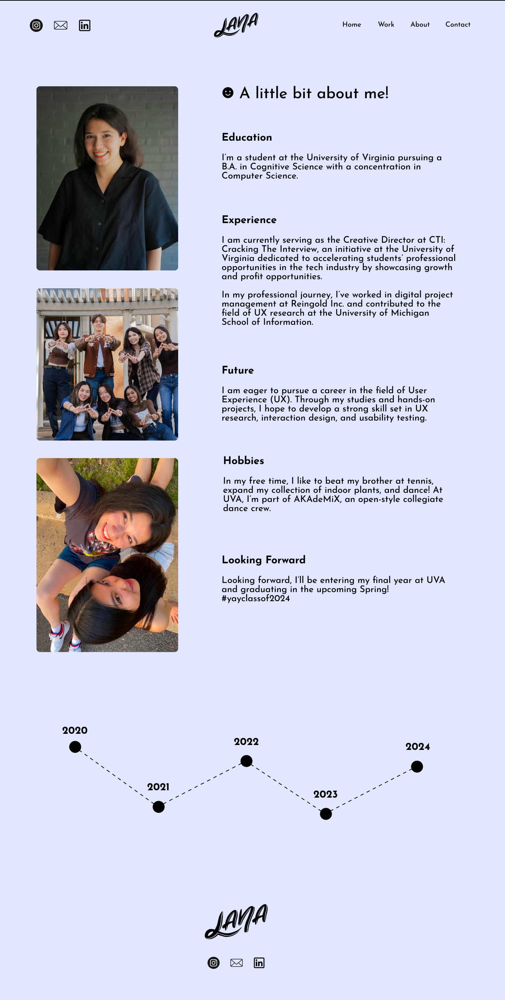
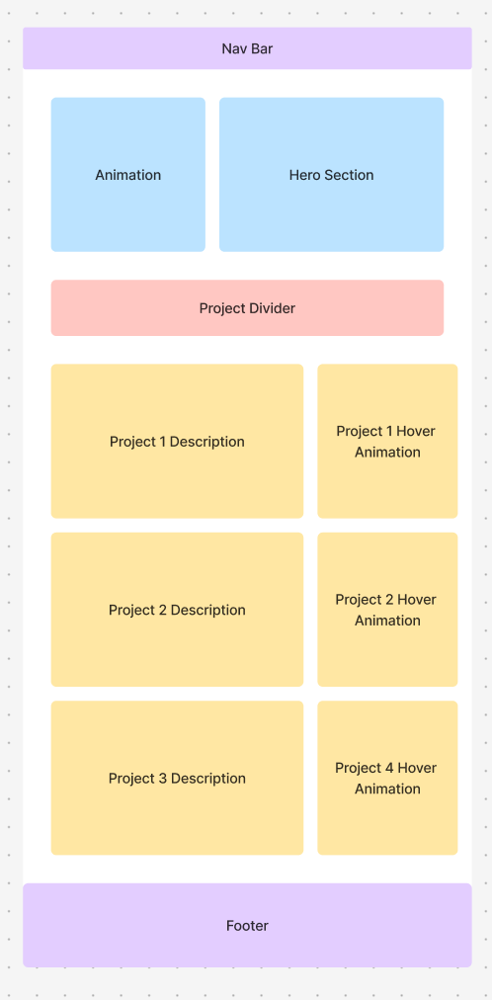
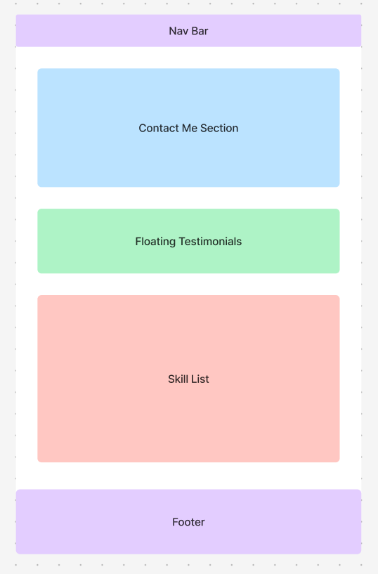
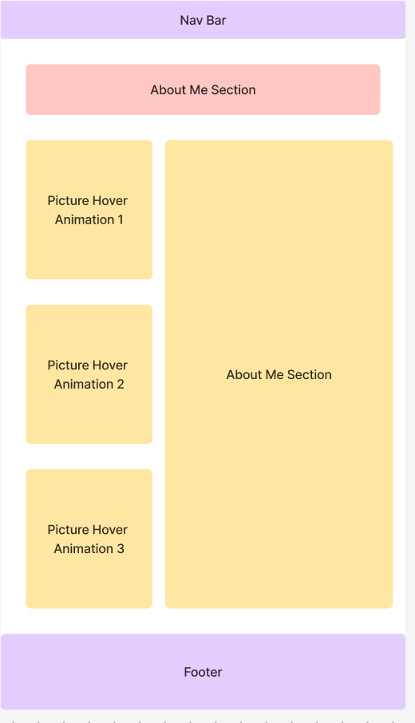
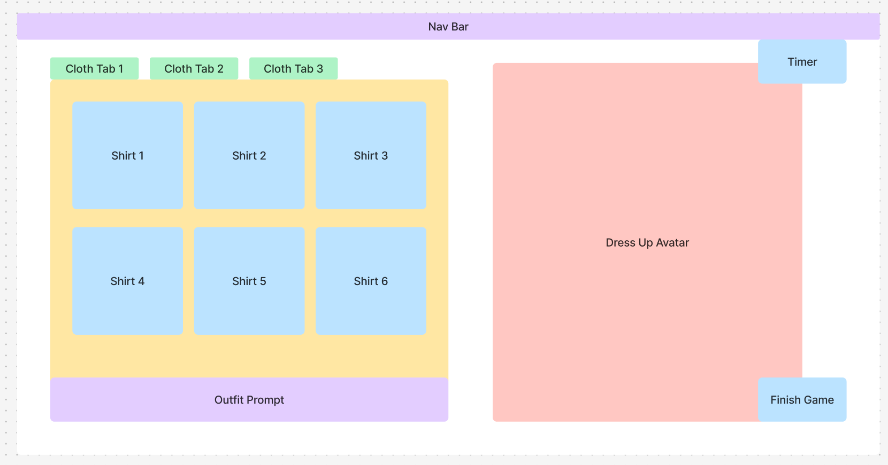
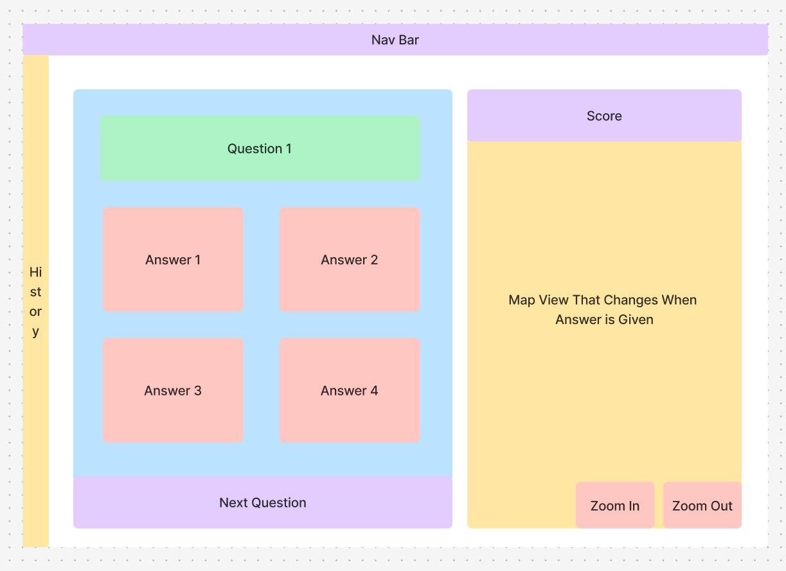

<mark>**Note that this document order from FP4 -> FP1**</mark>

<mark>Please sign up for the study</mark> at [https://tinyurl.com/pui-study](https://tinyurl.com/pui-study) to allow us to use your submission to create a better GenAI assistant for designers!

---

# **FP4 \- Final Project Writeup**

Feel free to refer to this [Markdown Cheat Sheet](https://www.markdownguide.org/cheat-sheet/) to make your writeup more organized, and you can preview your markdown file in VSCode [Markdown editing with Visual Studio Code](https://code.visualstudio.com/docs/languages/markdown#_markdown-preview). 

## Part 1: Website Description

Describe your website (300 words).

* What is the purpose of your website?
My portfolio website is designed to showcase my professional work and personal background in an interactive and engaging way, with a particular focus on my skills as a UX/UI designer. The website’s purpose is to provide potential employers, clients, and collaborators with an immersive experience that goes beyond a static portfolio. It offers an easy-to-navigate yet dynamic presentation of my skills, projects, and personal facts, helping visitors better connect with me both professionally and personally.
* Who is the target audience?  
The target audience includes employers, clients, and colleagues in the design industry who are interested in learning more about my work and qualifications. Additionally, the website appeals to anyone seeking inspiration in design or who might want to collaborate on projects.
* What information do you convey with your website? 
My website conveys a comprehensive overview of both my professional and personal identity as a UX/UI designer. It highlights my education, work experience, and aspirations, while also giving visitors a glimpse into my personality and interests.
- Homepage introduces me with a brief and engaging description of my work and passion for design, along with a playful tone that showcases my sense of humor.
- Portfolio displays key UX/UI projects, illustrating my skills and collaborations with others on impactful applications, with upcoming project details.
- Play offers an interactive memory game, where users can match fun facts about me with corresponding illustrations, adding a personal and engaging touch.
- About details my academic background, current studies, work experience, and hobbies, offering a well-rounded view of my professional journey and personal interests.
- Resume provides a downloadable PDF for a more formal, in-depth look at my qualifications and experience.  
* How is it interesting and engaging? 
The website is engaging through its blend of interactive, informative, and playful elements. The "Play" page features a fun memory game where users match personal facts with doodles, offering a lighthearted way to learn about me. The "About" section shares not just my qualifications but also personal hobbies and goals, creating a relatable and human touch. The "Portfolio" page showcases my work with visually appealing layouts, and the playful tone throughout, like referring to myself in the third person, adds personality. Easy navigation and responsive design ensure a smooth and enjoyable user experience.

## Part 2: User Interaction

How a user would interact with your website? For each step, briefly but clearly state the interaction type & how we should reproduce it.

1. Interaction Type: Click on the "Work" link in the navigation menu (on any page)
Description: The user clicks on the "Work" link to navigate to the portfolio section, where they can view my design projects and read more about each one.
How to Reproduce: Set up the navigation menu with links to different sections of the site (e.g., "Work," "Play," "About," "Resume"). Each link should be clickable, leading the user to the respective content section or page.

2. Interaction Type: Click on a project thumbnail in the "Work" section
Description: The user clicks on a project thumbnail (such as "StudySpot" or "Light the Muse") to see more details about each project.
How to Reproduce: Each portfolio item should have a clickable link that leads to a separate page or expands the project description in a modal, providing more information about the project, my role, and the process.

3. Interaction Type: Play the memory game on the "Play" page
Description: The user interacts with a memory game that involves matching personal facts with corresponding doodles. The game is both fun and informative, showcasing some of my interests and personality traits.
How to Reproduce: Set up an interactive memory game with clickable cards using JavaScript. When the user clicks a card, it flips over to reveal a personal fact or doodle. If the cards match, they stay revealed; if not, they flip back over. Include a counter for moves and a completion message when the user matches all pairs.

4. Interaction Type: Click to restart the memory game
Description: Once the user completes the memory game, they can click a "Restart" button to play again.
How to Reproduce: Create a restart button that appears after completing the game, and upon clicking, it resets the game board, moves counter, and completion message, allowing users to play multiple rounds.

5. Interaction Type: Hover effect over the about images
Description: When the user hovers over an image in the "About" section, a subtle animation occurs to draw attention to the project.
How to Reproduce: Use CSS hover effects to apply a transition, such as  rotating, when the user hovers over images, making the interface feel more interactive and engaging.

## Part 3: External Tool

Describe what important external tool you used (JavaScript library, Web API, animations, or other). Following the bulleted list format below, reply to each of the prompts.

1. JavaScript (Vanilla JS for game logic)
- Why did you choose to use it over other alternatives?
Vanilla JavaScript is a lightweight and versatile tool, perfect for implementing simple interactive games without needing extra dependencies. It allowed me to control the game’s behavior directly and handle logic with flexibility.
- How you used it?
I used JavaScript to build the memory matching game’s logic, including the card-flipping mechanism, shuffle function, and tracking moves. It also handles the matching logic, move counter, and game reset functionality.
- What does it add to your website?
It adds an interactive, engaging element to the website, providing users with a fun way to learn more about me. It demonstrates my skills in basic game development while also adding a personal touch to the experience.

2. CSS Animations (for card flipping and hover effects)
- Why did you choose to use it over other alternatives?
CSS animations are lightweight, easy to implement, and enhance the user experience by providing smooth transitions. They are perfect for interactive elements like card flipping and visual feedback.
- How you used it?
I used CSS animations to create the flip effect for the cards when clicked, as well as to add hover effects for the card images. The animations give users visual feedback, making the game feel dynamic.
- What does it add to your website?
It adds polish and visual appeal to the memory game, making it more immersive and engaging. The smooth animations contribute to a seamless user experience and elevate the interactivity of the game.

3. Web API (for responsive layout on different devices)
- Why did you choose to use it over other alternatives?
The Web API allows the website to be responsive across different screen sizes, ensuring a consistent experience on mobile, tablet, and desktop devices. It was an ideal choice for optimizing the game layout.
- How you used it?
I utilized CSS media queries, which dynamically adjust the game layout based on the screen size, ensuring the cards are properly arranged on any device. The API also supports different screen orientations.
- What does it add to your website?
It ensures that the memory game and other website elements look great and are functional on a variety of devices. This enhances accessibility and user engagement by providing a smooth experience across all screen sizes.

## Part 4: Design Iteration

Describe how you iterated on your prototypes, if at all, including any changes you made to your original design while you were implementing your website and the rationale for the changes. (4-8 sentences max)
During the design process, I iterated several times on the layout and functionality of the matching game. Initially, I had planned to use a more complex card matching mechanic with multiple levels, but I simplified it to focus on a single level to keep the game more accessible and fun. I also adjusted the color scheme to ensure it was visually engaging while maintaining good contrast for readability. In the hero section, I initially planned for a larger amount of text but decided to cut it down to keep the content concise and engaging. Finally, I refined the portfolio section, opting for a cleaner grid layout to better highlight the projects. These changes were made to enhance user experience and streamline interaction, ultimately focusing on a more polished and functional design.

## Part 5: Implementation Challenge

What challenges did you experience in implementing your website? (2-4 sentences max)
The main challenge I encountered was implementing the game logic for the memory matching game, particularly the card-flipping animation and ensuring that the matching logic was bug-free. Ensuring that the game functioned smoothly across different devices also took some extra effort, especially with maintaining responsive design for various screen sizes. Debugging the JavaScript and optimizing performance for both desktop and mobile views was a bit time-consuming.

## Part 6: Generative AI Use and Reflection

Describe how you used Generative AI tools to create this final project (fill in the following information, write \~500 words in total).

Document your use of all GenAI tools — ChatGPT, Copilot, Claude, Cursor, etc. using the template below. Add/Delete rows or bullet points if needed, and replace Tool1/Tool2 with the name of the tool.

Tool 1: ChatGPT

Why I Used It: ChatGPT was my primary tool throughout the project. I relied on it for brainstorming, writing content, generating code snippets, and refining my ideas. I chose ChatGPT for its ability to quickly generate text, offer suggestions, and assist with both technical and creative tasks, making it an invaluable resource throughout the development of my website.

How I Used It: I used ChatGPT to help generate content for various sections of the website, including the "About" page, project descriptions for my portfolio, and the introductory text on the homepage. ChatGPT also assisted with brainstorming ideas for the interactive memory game in the "Play" section, helping me come up with fun facts to match with images. Additionally, I requested JavaScript code snippets for the game logic and the card-flipping mechanism, which I integrated into my website.

What It Added to the Project: ChatGPT greatly sped up content creation by generating engaging text that I could directly use or modify. It helped ensure that the website's tone was both professional and approachable, and it improved the interactivity and user experience of the memory game by suggesting the structure and functionality of the game. Overall, ChatGPT was essential in making the project come together smoothly and efficiently, allowing me to focus more on the design and functionality of the site.

### Usage Experiences by Project Aspects

Feel free to edit the column \_ (other?) or add more columns if there's any other aspect in your project you've used the GenAI tools for.

For the following aspects of your project, edit the corresponding table cell to answer:
- *Usage*: Whether you used / did not use this tool for the aspect. Enter [Yes/No]
- *Productivity*: Give a rating on whether this tool makes your productivity for X aspect [1-Much Reduced, 2-Reduced, 3-Slightly Reduced, 4-Not Reduced nor Improved, 5-Slightly Improved, 6-Improved, 7-Much Improved].

| Tool Name | Ratings | design | plan | write code | debug | \_ (other?) |
| :---- | :---- | :---- | :---- | :---- | :---- | :---- |
| ChatGPT | Usage | Yes | Yes | Yes | Yes | Yes |
| ChatGPT | Productivity | 6 | 7 | 6 | 5 | n/a |

### Usage Reflection

> Impact on your design and plan 
* It matched my expectations and plan in [FP2](#generative-ai-use-plan) in that … For example, 
  1. Tool1 (ChatGPT): It helped me develop clear project goals and design concepts, as expected. For example, I used ChatGPT to generate ideas for structuring the homepage and portfolio section, which aligned with my initial vision of showcasing my work in a clean, visually appealing way.
* It did not match my expectations and plan in [FP2](#generative-ai-use-plan) in that … For example, 
  1. Tool1 (ChatGPT): It occasionally suggested features or design approaches I hadn't planned for, such as interactive animations, which were a bit outside my original scope. For example, ChatGPT suggested adding hover animations to portfolio items, which I hadn't considered but ultimately decided to implement.
* GenAI tool did/did not influence my final design and implementation plan because … For example, 
  1. Tool1 (ChatGPT): It did influence my design and implementation plan, especially by offering different perspectives and solutions for content and design. For example, it helped me refine the text for my homepage and portfolio descriptions to better engage users.

> Use patterns
* I accepted the generations when …  For example, 
  1. Tool1 (ChatGPT): This tool once suggested restructuring the homepage to highlight a personal introduction before diving into the portfolio. I accepted this suggestion because it provided a better flow and made the site more user-friendly, giving visitors a clear sense of who I am before exploring my work. 
* I critiqued/evaluated the generated suggestions by … For example, 
  1. Tool1 (ChatGPT): This tool once suggested using a dark color palette for the homepage, but I rejected the suggestion because it didn’t align with the light, fresh aesthetic I had planned. I opted for a lighter color scheme to make the website feel more inviting and less intense.

> Pros and cons of using GenAI tools
* Pros
  1. Tool1 (ChatGPT): It provided quick suggestions and creative ideas for structuring my website content, which saved time. Additionally, it helped refine the tone and style of my text, making it more engaging and consistent.
* Cons
  1. Tool1 (ChatGPT): Some suggestions felt a bit generic, and I had to spend time customizing them to fit my personal style and project needs. For example, some of the code snippets it provided needed significant modification to integrate seamlessly with my design.

### Usage Log

Document the usage logs (prompts and chat history links) for the GenAI tools you used. Some tools may not have an easy way to share usage logs, just try your best! Some instructions for different tools:

1. [ChatGPT](https://help.openai.com/en/articles/7925741-chatgpt-shared-links-faq) / [Gemini](https://support.google.com/gemini/answer/13743730?hl=en&co=GENIE.Platform%3DDesktop): share the anonymous link to all of your chat histories relevant to this project
2. [GitHub Copilot (VSCode)](https://code.visualstudio.com/docs/copilot/copilot-chat#:~:text=You%20can%20export%20all%20prompts%20and%20responses%20for%20a%20chat%20session%20in%20a%20JSON%20file%20with%20the%20Chat%3A%20Export%20Session...%20command%20(workbench.action.chat.export)%20in%20the%20Command%20Palette.): export chat histories relevant to this project.

---

# **FP3 \- Final Project Check-in**

Document the changes and progress of your project. How have you followed or changed your implementation & GenAI use plan and why? Remember to commit your code to save your progress.

## Implementation Plan Updates

- Since the initial proposal, my approach to the final project has evolved as I introduced a fun and interactive element to my portfolio— a matching game that reveals fun facts about me. This game was inspired by feedback suggesting more interactive elements to engage visitors. The key update to the implementation plan is the integration of this memory game into my personal portfolio. This game serves as a creative way to engage users while showcasing fun, personal facts about me.

The matching game will be fully integrated into the About Me section of my portfolio, adding interactivity to the more informational areas of the site. The user will flip cards that contain both personal phrases and images related to each phrase, making the game both entertaining and informative. This interactive feature will not only make the page more engaging but also personalize the experience for visitors.

## Generative AI Use Plan Updates

Content Refinement: ChatGPT continues to assist in rephrasing and refining the personal facts that will appear in the matching game. The aim is to make them concise, engaging, and fun, keeping the tone light and accessible.
Interaction Design: The AI has been useful for brainstorming how to present these facts in an engaging way, ensuring the game is not only interactive but also a valuable piece of my portfolio.
Troubleshooting: I’m using AI to help me troubleshoot any coding challenges that arise while implementing the game, especially related to animations and game state management (e.g., flipping cards and checking matches).

Remember to keep track of your prompts and usage for [FP4 writeup](#part-6-generative-ai-use-and-reflection).

---

# **FP2 \- Evaluation of the Final project**

## Project Description

For my final project, I chose to redesign my personal portfolio. The motivation behind this decision is to create an engaging, interactive platform that effectively showcases my skills, projects, and experiences while providing a visually appealing and seamless user experience. I wanted a design that highlights my work through dynamic elements and smooth animations, capturing the attention of potential clients or employers and leaving a lasting impression.

The basic idea of the project is to build a dynamic personal portfolio that uses hover animations and transitions to reveal project details in an engaging way. The portfolio will include sections like my biography, skills, project descriptions, testimonials, and contact information. These elements will be presented in a clean, interactive design that responds well to different screen sizes, ensuring accessibility and usability across all devices. The goal is to not only demonstrate my design abilities but also to make the process of exploring my work as enjoyable and immersive as possible for users.

## High-Fi Prototypes

### *Prototype 1*

Add links of your 2 high-fi prototypes that the teaching team can experiment with, and add a brief summary of the user feedback for each. Use about max. 1 page (<100 words, ~2 images) per prototype. Include a video clip showcasing all interactions.

Figma Link for Home + About: https://www.figma.com/proto/1hwHIUSv0WYk3UJ5tOBiJK/Lana's-Portfolio?node-id=19-3&node-type=canvas&t=mcTvWy9G8m8KtiBP-1&scaling=min-zoom&content-scaling=fixed&page-id=6%3A14&starting-point-node-id=19%3A3
Video Link for Home + About: (images/[PortfolioDemo.mov])

A brief description and summary of the user feedback (\<100 words, 2 images) 
The home page received positive feedback for its clean and minimalistic design, with users appreciating the interactive hover animations on the project thumbnails. Reviewers highlighted how the animations effectively drew attention to the project details, making it more engaging. However, a few users suggested adding a clear call-to-action (CTA) near the top of the page to guide visitors to key sections (e.g., portfolio, contact info). Overall, the home page was seen as visually appealing and user-friendly, but I plan to refine the CTA for better navigation.

### *Prototype 2*

The About Me page was praised for its clear layout and concise content. The profile image and bio were well-received, helping users feel connected with the designer. Some feedback suggested adjusting the typography for better readability, especially for longer sections of text. There was also a recommendation to add more interactive elements, such as a timeline of my career or interactive project highlights. These features could further engage users and give them more insight into my background. Overall, the page felt personal and informative, but could use a bit more visual flair.

## Usability Test

In addition to the specific feedback I received on the home and About Me pages, the overall usability test provided deeper insights that shaped my final design choices. One of the most consistent pieces of feedback across both pages was the importance of interactivity in keeping users engaged. The interactive hover effects on the home page were well-received, but users emphasized the need for smoother transitions and more intuitive animations. In response, I refined the animations to ensure that they were both visually appealing and functional, with a focus on providing clear, easily digestible project information as users interact with the page.

Another piece of feedback I implemented was related to accessibility. On both the home and About Me pages, users noted the importance of making sure text was legible for all audiences. For the home page, I made the text contrast sharper against the background and ensured that hover effects were not too fast, giving users time to engage with the content. On the About Me page, users highlighted the need for better typographic hierarchy, particularly for longer sections of text. This led me to increase the font size for body text and adjust the line spacing to improve readability.

The feedback about adding a clear call-to-action (CTA) on the home page inspired a new design direction. Originally, I had focused on a more subtle navigation style, but based on user input, I added a more prominent CTA at the top of the home page, directing visitors to key sections like my portfolio, contact info, and a downloadable resume. This change aligns with the goal of making the portfolio more user-friendly, as it ensures that visitors can quickly access the most important information.

Finally, users on the About Me page suggested that I integrate more dynamic elements, such as an interactive career timeline. This feedback led me to explore a more creative approach to storytelling by integrating a clickable, scrollable timeline that highlights key moments in my design journey. This addition not only enhanced the page's interactivity but also helped break up large chunks of text, making the content feel more engaging.

## Updated Designs

Show screenshots of your updated design based on the user feedback (\<100 words, \~2 images).

The updated home page now features a more prominent call-to-action (CTA) at the top, directing users to key sections like my portfolio and contact information. The hover animations on project thumbnails are smoother and more intuitive, with improved transitions that provide clear, concise project details. The navigation is more intuitive, ensuring visitors can easily access the most important sections of the site.

The About Me page has been enhanced with improved typography for better readability, including larger font sizes and more space between lines. I've also integrated an interactive career timeline, allowing users to explore my professional journey in a more engaging way. The addition of clickable project highlights helps break up the text and provides visitors with a more dynamic, visually interesting experience.

## Feedback Summary

During the lab session, I received feedback that was instrumental in refining both the content and interactivity of my portfolio design. One of the key points emphasized was the importance of clarity and accuracy in the language used throughout the site. Several users suggested that I revise some of the wording in the Home section to better reflect my professional experience and skills. The feedback prompted me to rethink certain phrases to ensure they were more precise and aligned with the tone I wanted to convey. For example, I changed phrases like "Lana Farkas is an aspiring UX/UI Designer" to "Lana Farkas is a UX/UI Designer," which more accurately describes my skill set and experience.

In addition to language adjustments, the feedback also highlighted the need for more interactive elements to enhance user engagement. Users suggested that the About Me page, in particular, felt static and could benefit from features that would encourage deeper exploration. As a result, I integrated an interactive career timeline that allows visitors to click through key milestones in my professional journey. This feature not only adds an element of fun but also breaks up the text, making the page more dynamic and visually engaging.

The home page also benefited from similar feedback. While users appreciated the hover animations, there was a suggestion to make them even more intuitive and informative. I revised the hover effects so that they not only reveal more project details but also allow users to interact more naturally with the content. The addition of a clearer call-to-action (CTA) was also a direct result of the feedback, ensuring that visitors could easily navigate to important sections of the portfolio.

## Milestones

Outline weekly milestones to plan your expected implementation progress until the end of the semester (\~300 words). 

### *Implementation Plan*

- [X] Week 9 Oct 28 \- Nov 1:
  - [X] FP1 due
  - [X] Develop usability test plan
  - [X] Finalize Home Page and About Me Page designs
  - [X] Prototype designs for testing
  - [X] Synthesize testing findings + lab evaluation
  
- [ ] Week 10 Nov 4 \- Nov 8:   
  - [X] FP2 due
  - [ ] Incorporate feedback from usability testing (animations, interactivity, typography)
  - [ ] Begin integrating responsive design

- [ ] Week 11 Nov 11 \- Nov 15: 
  - [ ] FP3 due
  - [ ] Work on Home Page features
  - [ ] Finish features for lab evaluations
  - [ ] Start working on About Page

- [ ] Week 12 Nov 18 \- Nov 22:  
  - [ ] Continue iterating on layout
  - [ ] Complete all interactive features for About Page

- [ ] Week 13 Nov 25 \- Nov 29:  
  - [ ] Continue iterating on rest of site layout
  - [ ] Complete all interactivity for rest of site (finish project outlines)
  - [ ] Clean up bugs + issues with site
  - [ ] Thanksgiving  

- [ ] Week 14 Dec 2 \- Dec 6:  
  - [ ] FP4 due 
  - [ ] Finish FP4 write-up

### *Libraries and Other Components*

List the JS libraries and other components (if applicable) that you plan to use. 
* React.js - building the user interface, leveraging its component-based architecture for modularity and reusability.
* Framer Motion - implementing smooth animations and transitions, particularly for hover effects, page transitions, and interactive elements.

## Generative AI Use Plan

Outline how you plan to use Generative AI tools to aid in the implementation (\~300 words).

For the implementation of my dynamic personal portfolio, I plan to use Generative AI tools in several key areas to enhance both the technical and content aspects of the project. First, ChatGPT will assist with refining the textual content across my portfolio, including the "About Me" section, project descriptions, and call-to-action (CTA) elements. I aim to ensure the language is clear, engaging, and tailored to my target audience, which includes potential clients and employers. AI will help generate variations or suggestions to improve these sections, making them more concise and compelling. However, I will ensure that I don’t rely solely on AI for content creation and will maintain a strong personal voice in the copy.

Next, I plan to leverage ChatGPT for analyzing and synthesizing insights from usability testing. AI can assist in identifying patterns or areas for improvement based on user feedback, especially concerning usability, interactivity, and accessibility. For example, if users mention issues with readability or navigation, AI can suggest specific refinements. While AI will provide helpful recommendations, I understand that it cannot replace the authenticity of real user testing.

On the technical side, ChatGPT will be useful for troubleshooting coding issues and providing best practices related to React.js and Framer Motion, especially for smooth animations and responsiveness. If I encounter challenges with hover effects or page transitions, I can ask AI for optimization suggestions or solutions. However, I will not rely on AI to build entire features without thorough testing, as I know the importance of ensuring that these components work seamlessly.

Additionally, AI will be valuable for brainstorming new features or interactive elements. For instance, following feedback about adding a career timeline, I might use AI to explore creative ways to make this feature more engaging or interactive. However, the final decisions about these features will be based on my own design choices and user feedback. Finally, AI will assist in ensuring the portfolio meets accessibility standards. I plan to use it for suggestions on improving text legibility, color contrast, and other inclusivity considerations. While AI can provide guidance, I will ensure all accessibility changes are tested and verified with real users.

### *Tool Use*

 What would you use? Edit the list given your plan. For each tool, explain briefly on what do you expect Generative AI to help you with and what might it not be able to help you with.

* ChatGPT  
  * I will use it for refining text, especially in areas where I need help articulating or rephrasing content for clarity, conciseness, and engagement. For example, improving the wording in the "About Me" section, crafting more impactful project descriptions, or generating ideas for more compelling calls-to-action (CTAs). 
  * I will use it to help me brainstorm or refine the insights from usability testing. It can also help formulate test questions or scenarios that focus on improving UX/UI design, accessibility, or user engagement.
  * I will use it to assist with coding-related questions or best practices (e.g., when troubleshooting React.js or Framer Motion issues) and provide suggestions for optimizing animations or interactivity.
  * I will not use it for making design decisions. While it can assist with content and provide feedback, it won’t help with visual design elements like layout, color schemes, or font choices.
  * I will not use it for writing entire features or building a complex structure, since this requires deep domain knowledge and testing.

### *Responsible Use*

How would you use Generative AI responsibly? 
I would use Generative AI responsibly by ensuring that the content and suggestions it generates align with ethical standards, respect intellectual property, and prioritize user privacy and safety. Specifically, I would double-check any information provided by AI, especially when it comes to data or advice that could impact decisions. AI is helpful for generating ideas or structuring content, but human oversight is crucial for ensuring accuracy and relevance. Additionally, I will ensure originality by not relying on AI-generated content for anything that might infringe on copyrights or fail to acknowledge the appropriate sources. If generating text, code, or other content, I'd make sure it doesn't replicate or plagiarize existing work. Lastly, I would use AI as a tool for enhancing my work, not as a substitute for human decision-making. For design-related tasks, I would still make final decisions based on user feedback, context, and expert knowledge.

---

# **FP1 \- Proposal for Critique**

## Idea Sketches

### *Idea 1* Personal Portfolio

Add a few sentences about your design. Briefly state the motivation of each project idea. Example questions to answer:

* What is the basic idea of your final project? (1-2 sentences)
The project aims to create a dynamic personal portfolio that showcases my work through visually engaging elements and interactive features, enhancing user experience.

* How do you plan to make your design interactive and engaging?  
I plan to incorporate hover animations and transitions that reveal project details, encouraging users to explore and interact with the content. Additionally, using responsive design ensures an engaging experience across devices.

* How do you plan to make your design accessible?  
To make the portfolio accessible, I'll use semantic HTML, provide text alternatives for images, and ensure that animations can be paused or stopped. Color contrast will be considered to aid users with visual impairments.

* What information do you specifically want to convey and include on your website?
The website will include my biography, project descriptions, skills, testimonials, and contact information, showcasing my expertise and allowing potential clients or employers to understand my work and capabilities.

### *Idea 2* Dress-Up Game

Add a few sentences about your design. Briefly state the motivation of each project idea. Example questions to answer:

* What is the basic idea of your final project? (1-2 sentences)
The project is a fun and interactive dress-up game where players can style a character using outfits inspired by my wardrobe, allowing for creative mix-and-match possibilities.

* How do you plan to make your design interactive and engaging?  
The game will feature drag-and-drop functionality, enabling players to easily combine clothing items and accessories. Scenario-based challenges will add an element of fun and strategy, enhancing user engagement.

* How do you plan to make your design accessible?  
To ensure accessibility, I’ll implement keyboard navigation options, provide clear labels for all interactive elements, and consider color-blind friendly palettes. Text descriptions will accompany visual elements for screen readers.

* What information do you specifically want to convey and include on your website?
The game will include information about the clothing items and accessories, tips for dressing according to scenarios, and possibly a section where players can share their unique styles or outfits created within the game.

### *Idea 3* Guess City/State

Add a few sentences about your design. Briefly state the motivation of each project idea. Example questions to answer:

* What is the basic idea of your final project? (1-2 sentences)
This interactive guessing game challenges players to identify cities or states based on clues related to their landmarks, climate, and culture.

* How do you plan to make your design interactive and engaging?  
The game will allow players to input their guesses, providing instant feedback on their answers. Hints for incorrect guesses will encourage continued engagement, making the game both fun and educational.

* How do you plan to make your design accessible?  
To make the game accessible, I’ll ensure that the text input is keyboard-friendly and that all clues are clear and concise. Visual clues will be accompanied by descriptions for users with visual impairments.

* What information do you specifically want to convey and include on your website?
The game will convey geographical and cultural knowledge, including fun facts about each city or state, fostering learning while players engage with the game.

## Feedback Summary

Summarize all the critiques you received during the lab session (\~300 words). 

During the lab session, feedback on my projects highlighted their unique aspects and potential for engagement. The dress-up game received particularly positive responses, with many participants appreciating its interactive nature and the opportunity it provides to showcase my personal style and illustrations. However, there were concerns about the project’s ability to support iterative programming effectively. It was noted that creating a meaningful MVP might require considerable work to function end-to-end, which could hinder incremental development. Limiting third-party assets was suggested to streamline the process.

The interactive personal portfolio also garnered interest, especially due to its innovative approach to animations and transitions. Reviewers liked the design elements, such as users hovering over project thumbnails to see brief descriptions and animations transitioning into a detailed view. These features were recognized as aligning well with the project's goal of demonstrating usability skills.

For the guessing game, feedback focused on its overall concept and the potential to integrate interactive elements related to geography. It was suggested that I consider how my design could stand out compared to a standard quiz engine that uses dropdown lists for locations. Encouragement was given to explore creative ways to enhance user engagement beyond basic functionalities, potentially by incorporating unique interactive features that deepen the learning experience.

Overall, the feedback provided valuable insights for refining my projects, clarifying the strengths of each design, and offering directions for further development. Each project has the potential to captivate users in its own unique way, and I’m excited to incorporate these suggestions into my designs.

## Feedback Digestion

Digest the feedback you got in the lab (\~300 words). Indicate which critique you will act on in your next design and why you chose to incorporate/dismiss pieces of critique.

The feedback from the lab session has provided valuable insights into all my projects, and I plan to improve upon each design in the next iteration. While I’m particularly drawn to the interactive personal portfolio due to its potential for showcasing my work effectively, I recognize the importance of refining the dress-up game and the guessing game as well.

For the interactive portfolio, I will focus on enhancing the hover interactions and animations that reveal project details, ensuring a seamless and engaging user experience. This will be a key priority, as it aligns well with the goal of demonstrating my usability skills.

In terms of the dress-up game, I plan to work on illustrating and animating the clothing items to enhance their visual appeal. I will also explore ways to format the game for iterative development, incorporating interactive elements that allow for multiple iterations and user engagement. This could include features like character customization options and scenario-based challenges, ensuring the game remains fresh and enjoyable.

Additionally, I’ll address the feedback on the guessing game by considering how to integrate unique interactive elements, such as visualizing locations on a map or globe. This will not only differentiate my design from standard quiz engines but also deepen the educational aspect of the game.